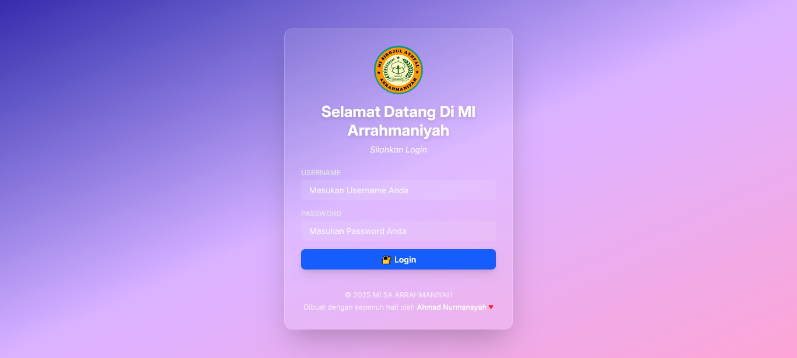

# 🎯 MikroTik Login Page - MI SA Arrahmaniyah

Halaman login custom untuk jaringan hotspot MikroTik, dirancang khusus untuk lingkungan sekolah dasar **MI SA Arrahmaniyah**. Menampilkan desain modern dengan sentuhan glassmorphism, responsif di semua perangkat, dan personal branding yang menyambut.

---

## 🖼️ Tampilan Awal



---

## ✨ Fitur Utama

- ✅ Desain modern (Tailwind CSS + Glassmorphism)
- ✅ Responsif di desktop dan mobile
- ✅ Efek animasi masuk (fade-in)
- ✅ Pesan error dinamis dari MikroTik
- ✅ Branding sekolah dan sentuhan personal
- ✅ Siap langsung digunakan di router MikroTik

---

## 🛠️ Teknologi yang Digunakan

- **HTML5**
- **Tailwind CSS** (tanpa build tool)
- **MikroTik Template Syntax** (`$(if error)`, `$(link-login-only)`, dll.)
- Google Fonts: Inter

---

## 📂 Struktur File

```bash
📁 /mikrotik-login-page
├── login.html         # Halaman utama login
├── styles.css         # Output CSS tailwind
├── Logo-Madrasah.png  # Logo sekolah
└── preview.png        # Screenshot preview halaman
```
